# Multi-Model Unified Organ Cancer Identifier

A deep learning framework for automated cancer detection across multiple organs using 3D convolutional neural networks. The system processes volumetric CT scans and classifies regions of interest as malignant or benign, with interpretable Grad-CAM visualizations for clinical transparency.

This project accompanies a research paper investigating whether lightweight 3D architectures can achieve high diagnostic accuracy on consumer-grade hardware (6 GB VRAM), making advanced cancer screening more accessible.

---

## Architecture Overview

Two compact 3D CNNs are trained and compared on each organ:

| Model | Parameters | Design Philosophy |
|-------|-----------|-------------------|
| **ResNet3D** | 3.62M | Residual connections with bottleneck blocks for gradient stability |
| **VGG3D** | 0.87M | Sequential convolutional stack prioritizing simplicity and speed |

Both architectures are organ-agnostic. The same model definitions are reused across all organs with no structural modifications, isolating the effect of data characteristics on performance.

### Shared Training Configuration

- **Validation:** Stratified 3-fold cross-validation
- **Loss:** Focal Loss (gamma=2, alpha=0.25) for class imbalance
- **Optimizer:** AdamW with cosine annealing + linear warmup
- **Regularization:** Dropout, weight decay, early stopping (patience=25)
- **Augmentation:** Random 3D flips, 90-degree rotations, Gaussian noise, intensity shifts
- **Efficiency:** Mixed-precision (AMP), gradient accumulation (effective batch size=16)
- **Inference:** 7-transform test-time augmentation with prediction averaging

---

## Organs and Results

### Lung Cancer Detection — Complete

**Dataset:** [LUNA16](https://luna16.grand-challenge.org/) (888 CT scans, 1,186 annotated nodules)

**Preprocessing:** Raw `.mhd` volumes resampled to isotropic 1 mm spacing, HU-windowed to [-1000, 400], cropped into 64x64x64 patches centered on candidate coordinates. Positive/negative sampling balanced via `WeightedRandomSampler`.

<table>
<tr>
<th>Model</th><th>AUC-ROC</th><th>Sensitivity</th><th>Specificity</th><th>F1 Score</th><th>Accuracy</th>
</tr>
<tr>
<td><b>ResNet3D</b></td><td>0.9918 +/- 0.0059</td><td>0.9074 +/- 0.0367</td><td>0.9816 +/- 0.0029</td><td>0.9076 +/- 0.0193</td><td>0.9692 +/- 0.0063</td>
</tr>
<tr>
<td><b>VGG3D</b></td><td>0.9944 +/- 0.0021</td><td>0.9243 +/- 0.0192</td><td>0.9831 +/- 0.0017</td><td>0.9203 +/- 0.0095</td><td>0.9733 +/- 0.0032</td>
</tr>
</table>

*All values reported as mean +/- standard deviation across 3 folds (8,106 test samples).*

**Key finding:** VGG3D (0.87M params) outperformed ResNet3D (3.62M params) across every metric with lower variance, suggesting that smaller models generalize better when medical imaging data is limited.

#### ROC Curves

<p align="center">
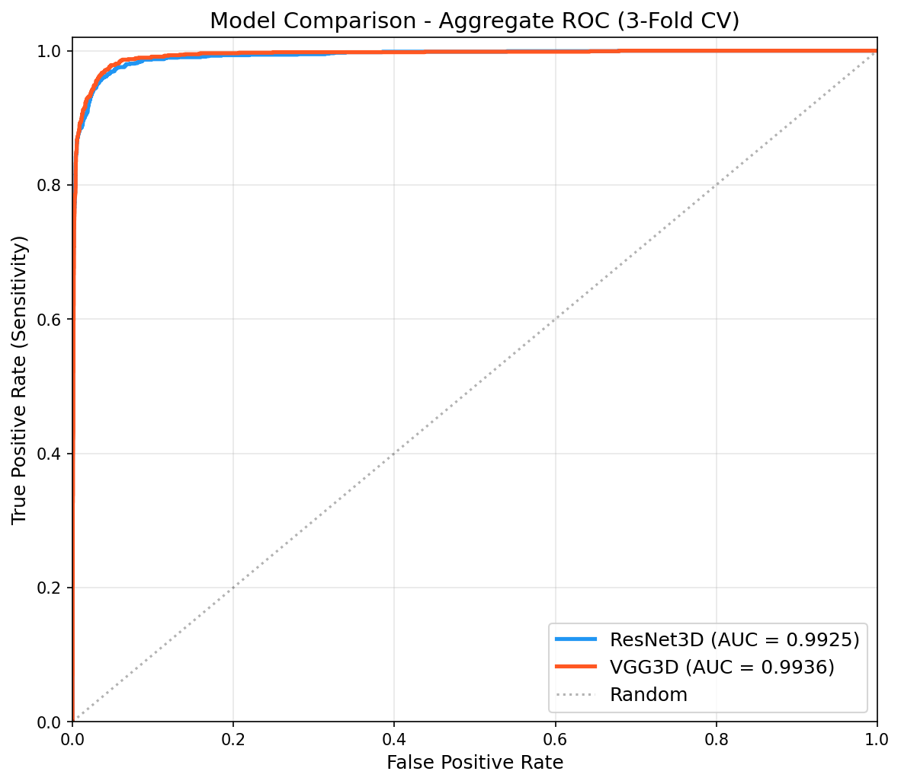
</p>

#### Training Curves

<p align="center">
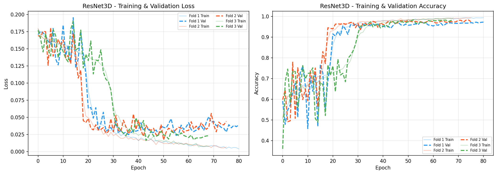
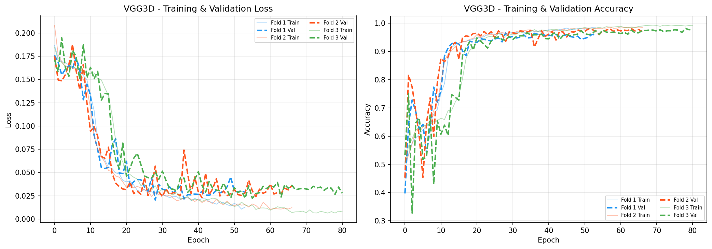
</p>

#### Grad-CAM Visualizations

3D Grad-CAM heatmaps overlaid on axial CT slices, showing model attention for true positives, true negatives, false positives, and false negatives.

**VGG3D:**
<p align="center">
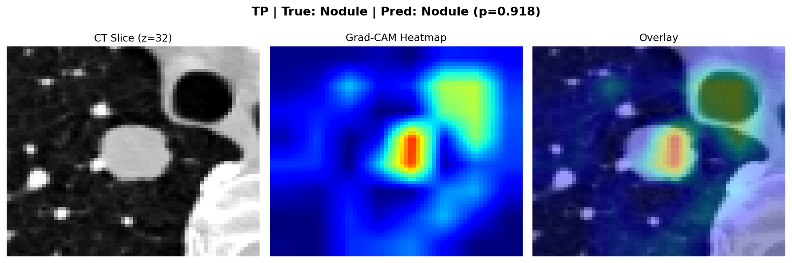
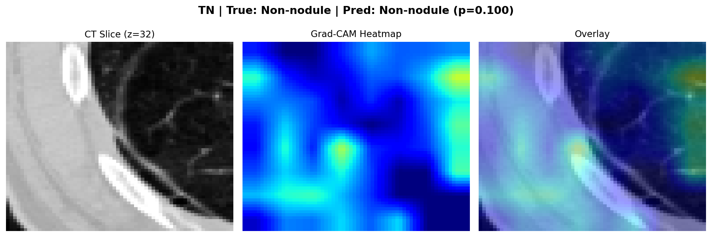
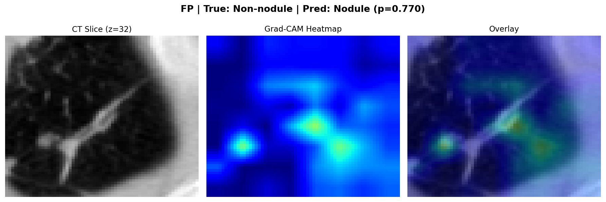
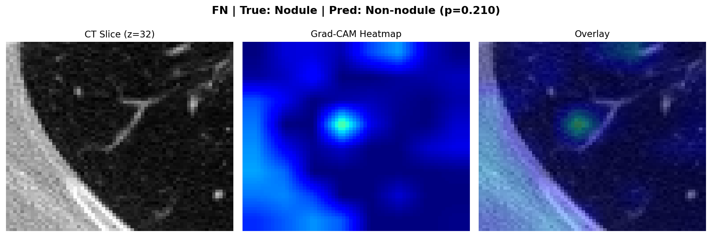
</p>
<p align="center"><i>Left to right: True Positive, True Negative, False Positive, False Negative</i></p>

**ResNet3D:**
<p align="center">
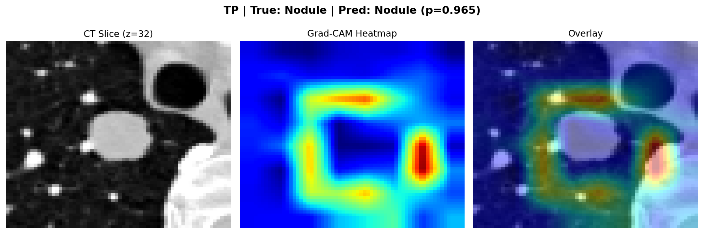
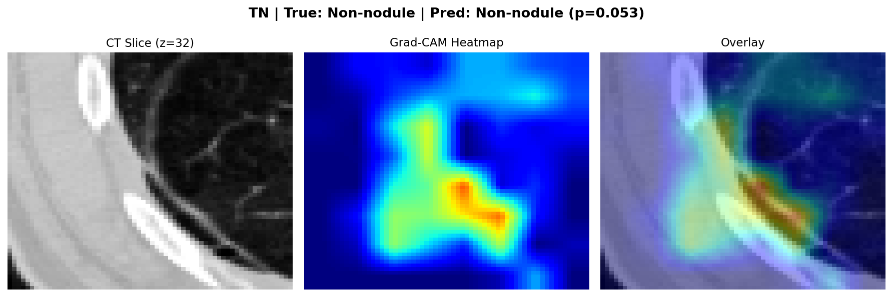
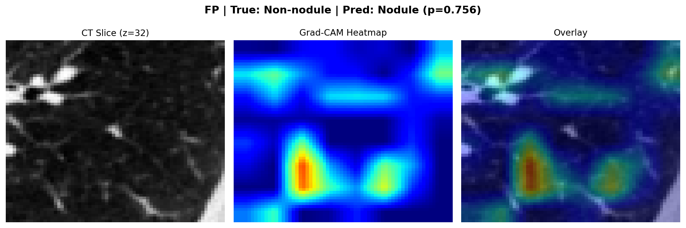
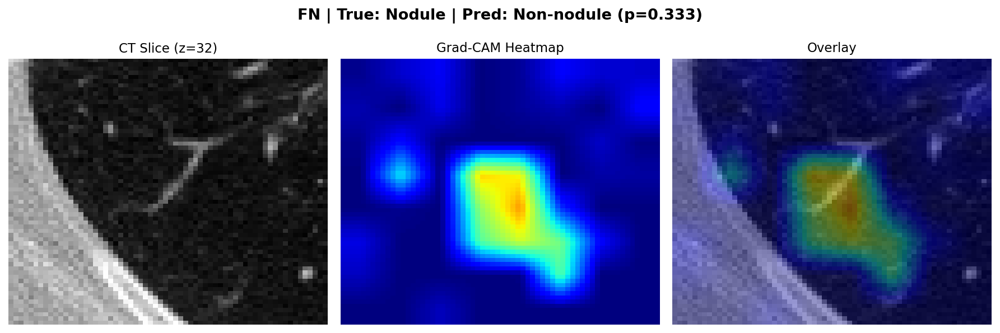
</p>
<p align="center"><i>Left to right: True Positive, True Negative, False Positive, False Negative</i></p>

---

### Liver Cancer Detection — In Progress

**Dataset:** [LiTS](https://competitions.codalab.org/competitions/17094) (131 contrast-enhanced CT scans with pixel-level segmentation masks)

**Preprocessing:** NIfTI volumes resampled to 1 mm isotropic, HU-windowed to [-200, 300] for liver parenchyma. Tumor centroids extracted from connected components in segmentation masks. Negatives sampled from verified tumor-free liver regions.

*Results will be published here upon completion of training.*

---

### Pancreas Cancer Detection — Planned

**Dataset:** [Medical Segmentation Decathlon — Pancreas](http://medicaldecathlon.com/) (281 CT scans)

*Implementation pending.*

---

## Project Structure

```
.
├── src/
│   ├── architecture.py          # ResNet3D and VGG3D model definitions
│   ├── training.py              # Trainer with focal loss, AMP, gradient accumulation
│   ├── evaluator.py             # Metrics calculator (AUC, sensitivity, specificity, F1)
│   ├── fast_dataset.py          # Dataset class with 3D augmentation pipeline
│   ├── gradcam.py               # 3D Grad-CAM visualization engine
│   ├── utils.py                 # Seed management, checkpoint utilities
│   ├── preextract.py            # Lung: LUNA16 patch extraction pipeline
│   ├── main.py                  # Lung: training and evaluation entry point
│   ├── preextract_liver.py      # Liver: LiTS patch extraction pipeline
│   └── main_liver.py            # Liver: training and evaluation entry point
├── results/
│   └── lung/
│       ├── plots/               # ROC curves, training curves, Grad-CAM figures
│       └── checkpoints/         # Trained model weights (not tracked in git)
├── data/
│   └── LUNA16_csv_backup/       # Annotation and candidate CSVs
├── Proof/                       # Training session documentation
├── requirements.txt
└── README.md
```

## Usage

Each organ follows a two-step pipeline: **extract patches** from raw CT volumes, then **train and evaluate** both models with cross-validation.

### Prerequisites

- Python 3.10+
- CUDA-capable GPU (tested on RTX 4050, 6 GB VRAM)
- ~30 GB free disk space per organ (for raw data + extracted patches; deletable after training)

### Installation

```bash
git clone https://github.com/LuxxyJr/Multi-Model-Unified-Organ-Cancer-Identifier.git
cd Multi-Model-Unified-Organ-Cancer-Identifier
pip install torch torchvision --index-url https://download.pytorch.org/whl/cu121
pip install numpy scipy scikit-learn matplotlib SimpleITK nibabel
```

### Running the Lung Pipeline

```bash
# Step 1: Download LUNA16 dataset to data/LUNA16/
# Step 2: Extract patches (run once, ~30 minutes)
python src/preextract.py

# Step 3: Train both models with 3-fold CV (~10 hours)
python src/main.py
```

### Running the Liver Pipeline

```bash
# Step 1: Download LiTS dataset to data/LiTS/
# Step 2: Extract patches (run once, ~30-60 minutes)
python src/preextract_liver.py

# Step 3: Train both models with 3-fold CV
python src/main_liver.py
```

After training completes for each organ, raw data and extracted patches can be safely deleted. Only checkpoints (~50 MB) and result plots are retained.

---

## Hardware Requirements

This project was designed and tested under strict hardware constraints to demonstrate that clinically relevant cancer detection is achievable without enterprise-grade infrastructure.

| Component | Specification |
|-----------|--------------|
| GPU | NVIDIA RTX 4050 Laptop (6 GB VRAM) |
| RAM | 16 GB DDR5 |
| Storage | NVMe SSD (30+ GB free per organ) |
| OS | Windows 11 |

Mixed-precision training and gradient accumulation enable an effective batch size of 16 within the 6 GB VRAM budget.

---

## License

This project is part of academic research. Please cite appropriately if used in derivative work.

---

## Author

**Sanchit Singh**
CGU Odisha | 2401020387@cgu-odisha.ac.in
